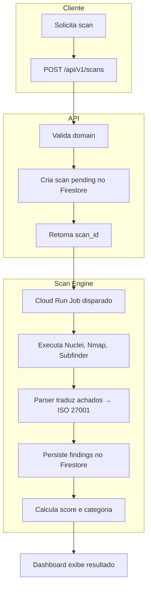
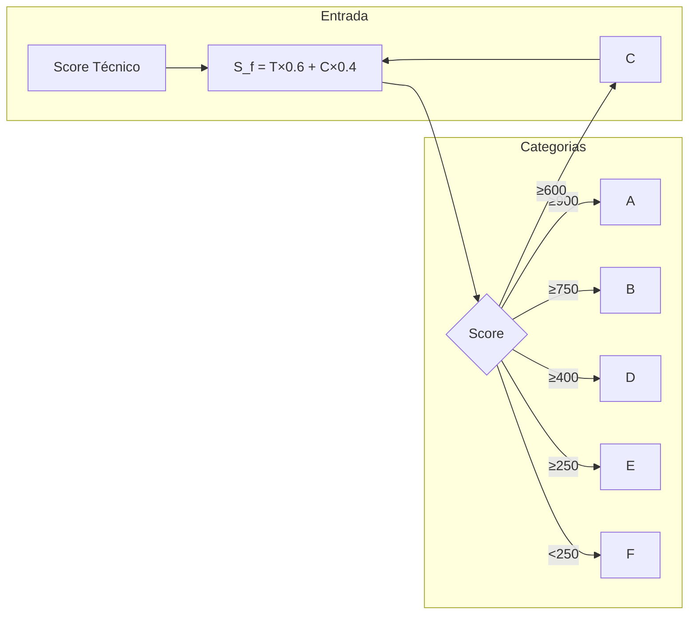
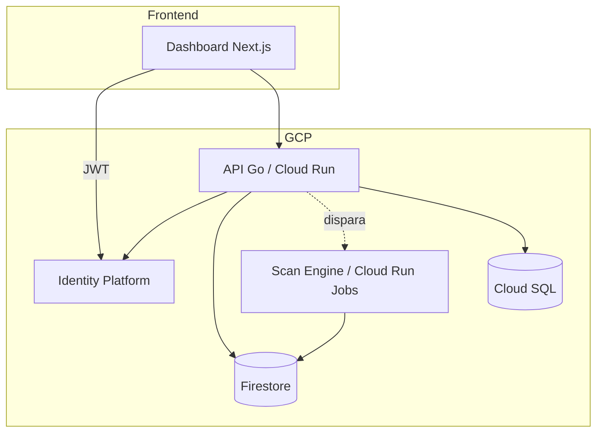

# n.Risk

Plataforma de avaliação de postura cibernética para **Cyber Insurance** e gestão de riscos de terceiros.

Combina scans passivos externos (Nuclei, Nmap, Subfinder) com questionários de conformidade e mapeamento automático para controles ISO 27001, gerando um **Score de Risco** (0–1000) e categoria (A–F) para subscrição, due diligence e Trust Center.

---

## Para quem é o n.Risk

| Stakeholder | Benefício |
|-------------|-----------|
| **Seguradoras** | Automatizar subscrição e monitorar risco das apólices em tempo real |
| **Empresas (GRC)** | Gerir segurança da cadeia de suprimentos e centralizar evidências de conformidade |
| **Fornecedores (Avaliados)** | Demonstrar transparência via Trust Center e acelerar vendas |

---

## Fluxo de Avaliação



### Etapas

1. **Cliente** solicita avaliação informando o domínio (ex: `example.com`)
2. **API** valida, cria o scan e retorna o ID
3. **Scan Engine** executa ferramentas em paralelo, traduz achados técnicos para controles ISO 27001 e calcula o score
4. **Resultado** fica disponível no Dashboard com score (0–1000), categoria (A–F) e achados mapeados

---

## Score e Categorias



- **T (Técnico):** Base 1000, com dedução por achados (portas críticas, SSL, DMARC, etc.)
- **C (Compliance):** Percentual de aderência aos questionários (ISO, NIST, LGPD)
- **Penalidade:** Achado crítico limita o score máximo a 500

---

## Arquitetura (Visão Geral)



| Componente | Função |
|------------|--------|
| **Dashboard** | Interface para subscritores, GRC e CISOs |
| **API** | Lógica de negócio, scans, questionários |
| **Scan Engine** | Execução de Nuclei, Nmap, Subfinder e tradução GRC |
| **Firestore** | Scans, findings e scores |
| **Cloud SQL** | GRC, controles e assessments |

---

## Início Rápido (Desenvolvimento)

```bash
cd backend
export GCP_PROJECT_ID=seu-projeto
export GOOGLE_APPLICATION_CREDENTIALS=/path/to/sa.json
go run ./cmd/api
```

```bash
# Executar scan (env vars obrigatórias)
TENANT_ID=org-1 SCAN_ID=uuid DOMAIN=example.com go run ./cmd/scan-job
```

---

## Documentação

| Documento | Conteúdo |
|-----------|----------|
| [Contexto do Projeto](.context/docs/contexto-nrisk.md) | Planos, docs e referências |
| [API Reference](.context/docs/api.md) | Endpoints e autenticação |
| [Fluxo de Dados](.context/docs/data-flow.md) | Integrações e fontes |
| [Arquitetura](.context/docs/architecture.md) | Componentes e decisões |

---

## Repositório

**GitHub:** [https://github.com/resper1965/nRisk](https://github.com/resper1965/nRisk)
